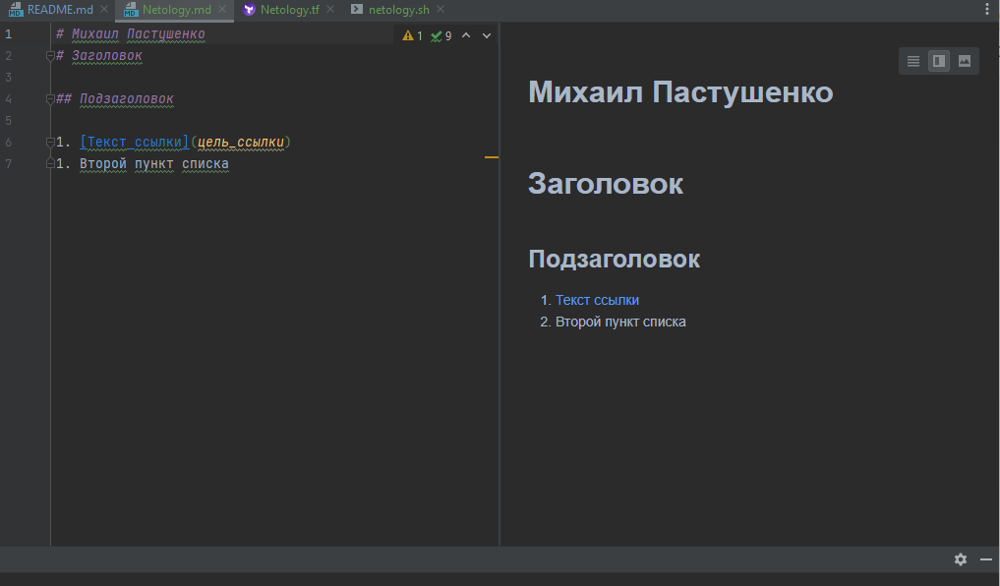
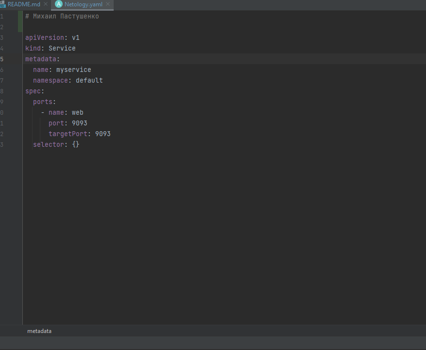
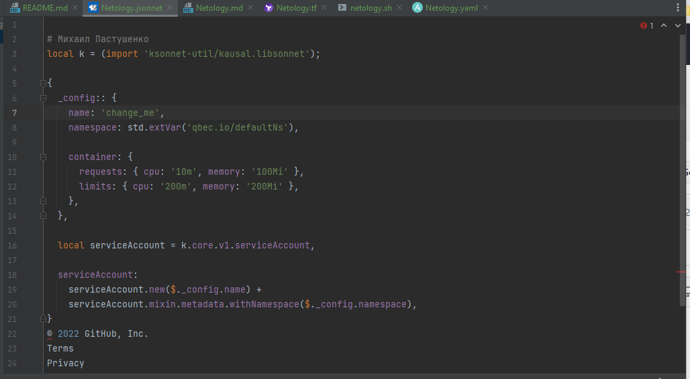

Задание №1 - Подготовка рабочей среды

1.Netiology.tf

2.Netology.sh

3.Netology.md

4.Netology.yaml

5.Netology.jsonnet

Задание 2 Описание жизненого цикла задачи

1) Получение задачи. Клиенты и менеджеры составляют список требований/задач к функционалу интернет-магазину
2) Постановка задачи. Менеджеры выделяют список задач (бэклог на конкретный спринт) и определяют критерии проверки задачи
3) Разработка задачи. Разработчики реализуют функционал. Инженеры DevOps настраивают инструменты автоматической сборки дисрибутивов с новым функционалом, установки их на стенды и тестирования.
Разработчики устанавливают с помощью инструментов DevOps функционал на тестовые стенды
4) Тестирование задачи. Тестировщики проводят функциональное и нагрузочное тестирование
5) Внедрение задачи. В случае успешного тестирования производится установка на задачи на промышленный стенд. В случае неуспешного задача отправляется на доработку. 